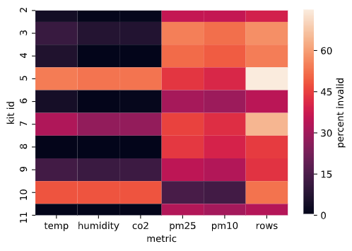
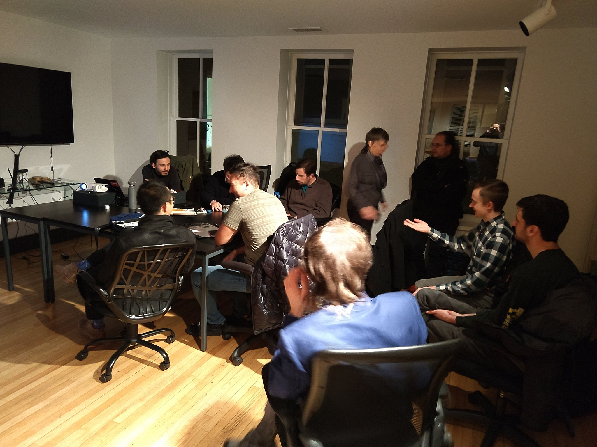

View the full paper on [IEEExplore](https://ieeexplore.ieee.org/Xplore/home.jsp)
or read the [pre-print](The_Deployment_of_a_LoRaWAN-Based_IoT_Air_Quality_Sensor_Network_for_Public_Good.pdf)

_This link will be updated when the official paper is published_

# Overview

---

As a part of the 2019-2020 Masters of Science in Data Science ([MSDS](https://datascience.virginia.edu/degrees/msds-degree)) program at the University of Virginia (UVA) School of Data Science (SDS), all students complete a capstone project. Our project was in collaboration with the [UVA Link Lab](https://engineering.virginia.edu/link-lab-0) and a local non-profit, [Smart Cville](https://www.smartcville.com/). Our overarching goal was to implement an air quality sensor network throughout Charlottesville that would provide citizens with access to open data about their air. Together, we established 4 major goals:

1. Expand the LoRa network throughout Charlottesville
2. Design an air quality sensor kit
3. Provide open access to our collected data
4. Analyze our collected data

# The LoRa Network

---

[LoRa](https://en.wikipedia.org/wiki/LoRa) is a spread-spectrum modulation technique that allows low density data to be transmitted over long distances using low power. Our collaborators had already begun implementing the LoRa network throughout Charlottesville by distributing The Things Network ([TTN](https://www.thethingsnetwork.org/)) Gateways. These provide up to 10km radius of LoRa coverage and connect to standard WiFi or ethernet to transport packets to the internet.

_LoRa Gateway Distribution in Charlottesville 04/2020_

# Sensor Kit Assembly

---

## Hardware

### [Adafruit Feather M0 RFM95 LoRa Radio](https://github.com/adafruit/Adafruit-Feather-M0-RFM-LoRa-PCB)

This MCU comes in a small form-factor, allows us to provide both 3.3v and 5v source voltage to our sensors, and includes an on-board LoRa Radio. While more expensive than more custom options, it greatly simplifies our design.

### [Plantower PMS7003](sensorboxes/hardware/datasheets/pms7003-datasheet.pdf)

The PMS7003 is a state-of-the-art particulate matter (PM) sensor, sensing PM 1.0, 2.5, and 10. Its small form-factor, low power-consumption, and high accuracy make it a great choice for our sensor kits. It does not come with US-standard pins so you will need [an adapter](https://kamami.pl/en/other-connectors/564553-adapter-from-127mm-pitch-to-254mm-for-pms7003.html) to standardize the pins.

### [Sensirion SCD30](https://www.sensirion.com/en/environmental-sensors/carbon-dioxide-sensors/carbon-dioxide-sensors-co2/)

The SCD30 is an indoor NDIR CO2 sensor with an onboard temperature and humidity sensor. It provides high accuracy readings but consumes more power than is ideal for these applications. Future iterations should focus on reducing the power consumption of this part or replace it with an alternative.

The full parts list for our pilot prototype can be found [here](sensorboxes/sbox0/Pilot_Prototype_Component_List.pdf).

## Firmware

Our firmware code is freely available on [Github](https://github.com/thejimster82/CvilleAQ/tree/master/sensorboxes/sbox0) along with the requisite libraries. The ttn-credentials.h file will need to be filled out with the credentials for the TTN application to which you wish to send data. The application must also be set up to [decode](https://learn.adafruit.com/the-things-network-for-feather/payload-decoding) the packets sent by the sensor kits, this code can be copied from Decoder.js in our repo.

## Circuit Diagram

## Housing Assembly

Our pilot prototype was assembled using plastic containers which we do not recommend for future users. We recommend to use one of our [3D-printed enclosures](https://github.com/thejimster82/CvilleAQ/tree/master/3D-design) instead, they include in-built supports for both the PMS7003 and the SCD30. In the event that you must use a plastic container, we recommend at least printing the supports for the sensors as it makes attaching them to the container much easier.

_Pilot prototype construction with research assistant Keerthi Radhakrishnan_

_Pilot prototypes test deployment_

_Revision 1 assembled_

# Open Data

---

All of the data collected for this project can be downloaded and visualized at the following locations:

## Grafana

Grafana provides realtime timeseries plots of our data and allows csv downloads. You can access the full site [here](https://sensors.unixjazz.org/d/xUrC1m8Zz/sbox-all?from=now-7d&to=now&orgId=1).

<iframe src="https://sensors.unixjazz.org/d-solo/xUrC1m8Zz/sbox-all?from=1587077252684&to=1587682052684&orgId=1&theme=light&panelId=4" width="450" height="200" frameborder="0"></iframe>
<iframe src="https://sensors.unixjazz.org/d-solo/xUrC1m8Zz/sbox-all?from=1587077272477&to=1587682072478&orgId=1&theme=light&panelId=6" width="450" height="200" frameborder="0"></iframe>
<iframe src="https://sensors.unixjazz.org/d-solo/xUrC1m8Zz/sbox-all?from=1587077057930&to=1587681857930&orgId=1&theme=light&panelId=11" width="450" height="200" frameborder="0"></iframe>

## Realtime Map

Our realtime map lets you see the air quality right now at locations around Charlottesville. You can view it [here](https://data.unixjazz.org/).

## API

Our API is currently in the works and will make our data machine-readable.

# Analysis

---

Find the code for the below analyses in the [notebooks](https://github.com/thejimster82/CvilleAQ/tree/master/notebooks) folder of our Github repo. For these analyses, we used data collected from our 10-sensor network between 02/03/2020 and 04/15/2020, totalling 46309 rows with 9 columns: co2, pm25, pm10, temp, humidity, latitude, longitude, dev_id, and fdt(datetime).

## Data Cleaning

Our sensors operate only within certain bounds (these can be found on their respective datasheets) and we know Charlottesville's weather well enough to rule out specific conditions. Beyond this, we knew that sensors that were malfunctioning would report consistent values or linearly-varying values over long periods of time. Using these two considerations, we were able to construct a simple data-cleaning strategy that removes data that is out-of-bounds and that is behaving linearly for an extended period of time. After performing the data removal we were able to visualize which kit had issues with which metrics through a heatmap, shown below. From this we can see that most of our kits had issues with the PMS7003, and a few had issues with the SCD30. This type of visual might allow us to detect particularly problematic kits in the future and to go into the debugging process with some level of insight as to where the problem lies. We found that ~25% of our incoming readings were invalid and ~50% our rows included at least one invalid reading. Our further analyses remove all rows with **any** invalid metrics.

_Percent invalid data by metric and by kit, 'rows' indicates percent of rows that included at least one invalid metric_

## Calibration

Our sensor kits were not placed close enough to reference-grade instruments to perform collocation testing. However, all PMS7003 units are pre-calibrated and [it has been shown](https://www.researchgate.net/publication/327162626_Field_evaluation_of_low-cost_particulate_matter_sensors_in_high-_and_low-concentration_environments) that this procedure succeeds in keeping their readings close to reference instrumentation. Furthermore, [it has been shown](https://link.springer.com/article/10.1007/s42452-019-0630-1) that the coefficient of variation between units is below 10%. We took the EPA's reported PM2.5 data from Charlottesville and compared it to our sensor values and saw that, in aggregate, the difference between their readings fit a normal distribution with mean ~4.3ug/m3 and standard deviation ~2.1ug/m3. We did not adjust our readings for our further analyses as assigning blame for the discrepancies to each individual kit was not possible because our kits and the reference instrument were not collocated.

_Difference in EPA-reported PM2.5 and kit-aggregated PM2.5 averaged per-day_

_Density plot of difference in EPA and kit readings with fitted normal distribution_

## Anomaly Detection

After cleaning our data we used an isolation forest on our five metrics: CO2, PM2.5, PM10, temperature, and humidity, to detect which kits were generating the most anomalous behavior. We saw that our eighth kit was generating the most anomalies. After further analysis, we found that this kit was located very close to the train-tracks that run through Charlottesville which could easily cause it to generate behavior very different from our other kits. This kind of analysis might be another method of detecting sensor kits that are behaving oddly, especially in a greatly expanded network where combing through all of the data could take a very long time. In contrast to the earlier data cleaning step, this procedure is not to detect faulty behavior but, instead, notable behavior.

_Anomaly count per sensor kit_

## Distance Correlation

Having sensors spread throughout an area, we would expect their readings to be more similar when they are closer together. We can test this assumption by finding the correlation between the set of readings from each kit with each other kit and plotting it against the distance between those kits. This is pictured below for PM10 ([similar results](https://github.com/thejimster82/CvilleAQ/tree/master/assets/img/analysis) were found for PM2.5 and CO2) and, as you can see, our assumption is not verified. We believe that this is because air quality variations can be highly localized, especially in an urban environment. We believe that this indicates that a higher density of air quality sensing kits is necessary in order to capture all of the meaningful information within the environment. This could be tested in future research to determine a standardized average distance for placing air quality sensors in an urban environment.

_PM10 Distance Correlation Plot, R2=0.004_

## Heatmaps

The largest result of our analysis was a comparison of the air quality in Charlottesville before and after the announcement by UVA that classes would move online. We used this as a breakpoint for the beginning of social distancing in Charlottesville. Using data from our sensors we were able to visualize the decrease in CO2 levels across Charlottesville.

_Mean CO2 (ppm) Change Before and After March 11th_

Along with heatmaps for the change in CO2, we were able to generate general heatmaps to show the average values of various metrics across the city. One of our future goals is to implement a realtime-version of this analysis and host it so Charlottesville citizens can have easy access to a simple visual of the air quality across the city.

_Average PM2.5 (ug/m3) February 03 to April 15 2020_

# Community Events

---

Over the course of our project we met with various members of the community to discuss ideas for the design, implementation, and future goals of this project and other similar projects in the Charlottesville community. These discussions were generally organized by our sponsor at Smart Cville, Lucas Ames. He was an indispensable part of the team and really made connecting with the community possible.

_Meeting with C3 and LEAP Environmental Groups_

_Civic Hack Night with the UVA Architecture School and SDS_

_Community Climate Collaborative (C3) Director of Climate Policy Caetano de Campos Lopes inspecting our pilot prototype sensor kit at an Open Source Environmental Sensing Info Session_

# Related Projects

---

### [Air Quality Egg](https://airqualityegg.com/home)

### [Safecast Air](https://safecast.org/)

### [Publiclab](https://publiclab.org/)

### [Smart Citizen](https://smartcitizen.me/)

### [AirCasting](https://www.habitatmap.org/aircasting)

### [HackAIR](https://www.hackair.eu/)

### [Luftdaten](https://luftdaten.info/en/home-en/)

### [PurpleAir](https://www2.purpleair.com/)

### [The Air Quality Data Commons](https://aqdatacommons.org/)

# The Team

---

## Researchers

### **James Howerton**

_UVA School of Data Science_

email: **jh3df@virginia.edu**

[LinkedIn](https://www.linkedin.com/in/james-howerton/)

[Resume](https://www.jameshowerton.dev)

### **Ben Schenck**

_UVA School of Data Science_

email: **bls7cc@virginia.edu**

[LinkedIn](https://www.linkedin.com/in/benjamin-schenck-a08248141/)

## Mentors

### **Jon Kropko**

_UVA School of Data Science_

### **Luis Felipe Rosado Murillo**

_UVA School of Data Science_

## Sponsors

### **Lucas Ames**

_Smart Cville_

### **Jon Goodall**

_UVA Link Lab_
